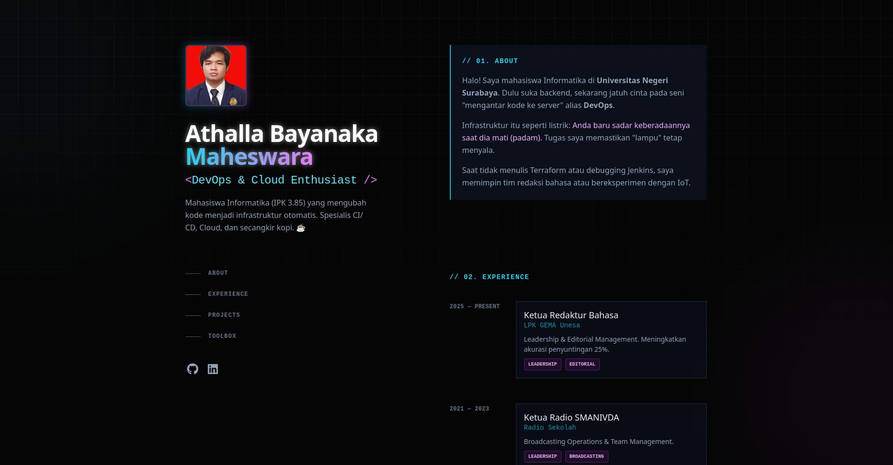
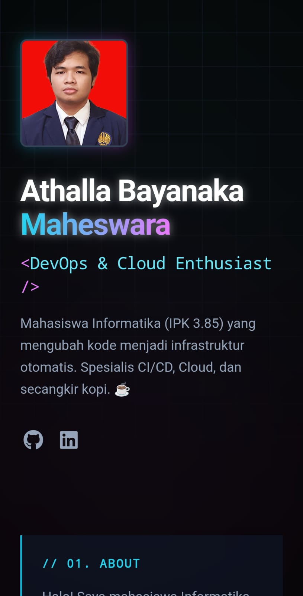

# ⚡ Next.js DevOps Portfolio - Tokyo Neon Edition


> **"Infrastructure as Code is like sleep: you only notice it when it's missing."**

Sebuah website portfolio modern dengan tema **Tokyo Neon / Cyberpunk**, yang dibangun bukan hanya untuk keindahan visual, tetapi sebagai demonstrasi kemampuan **Full-Cycle DevOps**. Proyek ini mengimplementasikan pipeline CI/CD otomatis, kontainerisasi, keamanan infrastruktur, dan manajemen server cloud.

---

## 📸 Preview

| **Desktop View (Tokyo Neon)** | **Mobile / Responsive** |
|:---:|:---:|
|  |  |
*(Note: Screenshots represent the actual deployed site on AWS EC2)*

---

### Application & Frontend
* **Framework:** Next.js 14 (App Router)
* **Styling:** Tailwind CSS (Custom Tokyo Neon Theme)
* **UI Features:** Glassmorphism, Sticky Sidebar, Responsive Grid
* **Language:** TypeScript

---

## 🚀 How to Run Locally

Ingin mencoba menjalankan proyek ini di mesin lokal Anda?

1.  **Clone Repository**
    ```bash
    git clone [https://github.com/Arzenos/My-Portfolio.git] (https://github.com/Arzenos/My-Portfolio.git)
    cd My-Portfolio.git
    ```

2.  **Install Dependencies**
    ```bash
    npm install
    ```

3.  **Run Development Server**
    ```bash
    npm run dev
    ```
    Buka [http://localhost:3000](http://localhost:3000) di browser Anda.

4.  **Run Production Build**
    ```bash
    npm run build
    npm start
    ```

---

## 👤 Author

**Athalla Bayanaka Maheswara**
* **Role:** DevOps & Cloud Enthusiast
* **GitHub:** [@Arzenos](https://github.com/Arzenos)
* **LinkedIn:** [Athalla Maheswara](https://www.linkedin.com/in/athalla-maheswara-406b9b268/)

---
