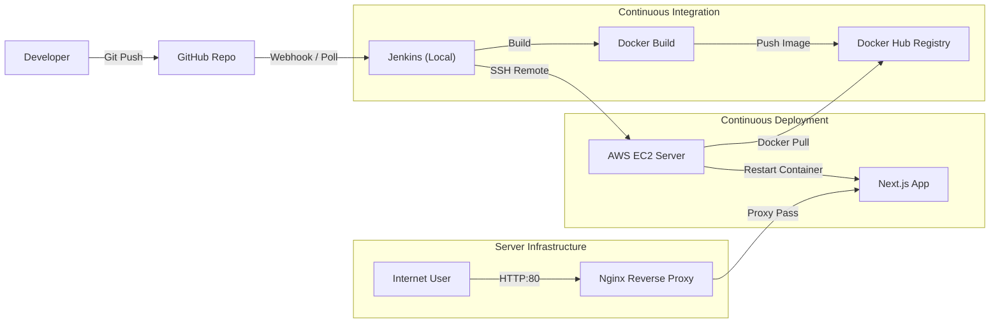

# ⚡ Next.js DevOps Portfolio - Tokyo Neon Edition


> **"Infrastructure as Code is like sleep: you only notice it when it's missing."**

Sebuah website portfolio modern dengan tema **Tokyo Neon / Cyberpunk**, yang dibangun bukan hanya untuk keindahan visual, tetapi sebagai demonstrasi kemampuan **Full-Cycle DevOps**. Proyek ini mengimplementasikan pipeline CI/CD otomatis, kontainerisasi, keamanan infrastruktur, dan manajemen server cloud.

---

## 📸 Preview

| **Desktop View (Tokyo Neon)** | **Mobile / Responsive** |
|:---:|:---:|
|  |  |
*(Note: Screenshots represent the actual deployed site on AWS EC2)*

---

## 🏗️ Architecture & CI/CD Pipeline

Proyek ini menggunakan pendekatan **Hybrid CI/CD**, di mana Jenkins berjalan di lingkungan lokal (Local Master) untuk efisiensi biaya, namun men-deploy aplikasi ke Cloud (AWS EC2) secara aman menggunakan SSH Tunneling.



### ⚙️ DevOps Workflow:
1.  **Code & Commit:** Pengembangan fitur menggunakan Next.js & Tailwind CSS.
2.  **Version Control:** Push code ke GitHub `main` branch.
3.  **Automated Build:** Jenkins mendeteksi perubahan, mem-build Docker Image, dan push ke Docker Hub.
4.  **Secure Deployment:** Menggunakan Jenkins Credentials untuk menyembunyikan IP Server & SSH Keys (No Hardcoded Secrets).
5.  **Zero-Touch Deployment:** Script otomatis melakukan SSH ke AWS EC2, menarik image terbaru, dan me-restart container.
6.  **Reverse Proxy:** Nginx dikonfigurasi di depan container untuk menangani traffic HTTP (Port 80) dan meneruskannya ke aplikasi (Port 3000), menghilangkan kebutuhan port di URL.

---

## 🛠️ Tech Stack

### Infrastructure & DevOps
* **Cloud Provider:** AWS (EC2 t3.micro / Ubuntu 22.04 LTS)
* **Containerization:** Docker & Docker Hub
* **CI/CD:** Jenkins (Pipeline as Code / Jenkinsfile)
* **Web Server:** Nginx (Reverse Proxy & Load Balancing)
* **IaC:** Terraform (Infrastructure Provisioning)
* **Version Control:** Git & GitHub

### Application & Frontend
* **Framework:** Next.js 14 (App Router)
* **Styling:** Tailwind CSS (Custom Tokyo Neon Theme)
* **UI Features:** Glassmorphism, Sticky Sidebar, Responsive Grid
* **Language:** TypeScript

---

## 🚀 How to Run Locally

Ingin mencoba menjalankan proyek ini di mesin lokal Anda?

1.  **Clone Repository**
    ```bash
    git clone [https://github.com/Arzenos/my-mini-project.git](https://github.com/Arzenos/my-mini-project.git)
    cd my-mini-project
    ```

2.  **Install Dependencies**
    ```bash
    npm install
    ```

3.  **Run Development Server**
    ```bash
    npm run dev
    ```
    Buka [http://localhost:3000](http://localhost:3000) di browser Anda.

4.  **Run Production Build**
    ```bash
    npm run build
    npm start
    ```

---

## 🔒 Security Measures
* **SSH Key Authentication:** Akses server hanya melalui SSH Key pair (Password login dimatikan).
* **Firewall (AWS Security Groups):** Hanya port 22 (SSH), 80 (HTTP), dan 443 (HTTPS) yang dibuka untuk publik.
* **Secrets Management:** Semua credentials sensitif disimpan di Jenkins Credentials Store.
* **Nginx Reverse Proxy:** Menyembunyikan port aplikasi internal dan header server dari publik.

---

## 👤 Author

**Athalla Bayanaka Maheswara**
* **Role:** DevOps & Cloud Enthusiast
* **GitHub:** [@Arzenos](https://github.com/Arzenos)
* **LinkedIn:** [Athalla Maheswara](https://www.linkedin.com/in/athalla-maheswara-406b9b268/)

---

*Project ini dibuat sebagai demonstrasi kemampuan teknis dalam mata kuliah Komputasi Awan & Penjaminan Kualitas Perangkat Lunak.*